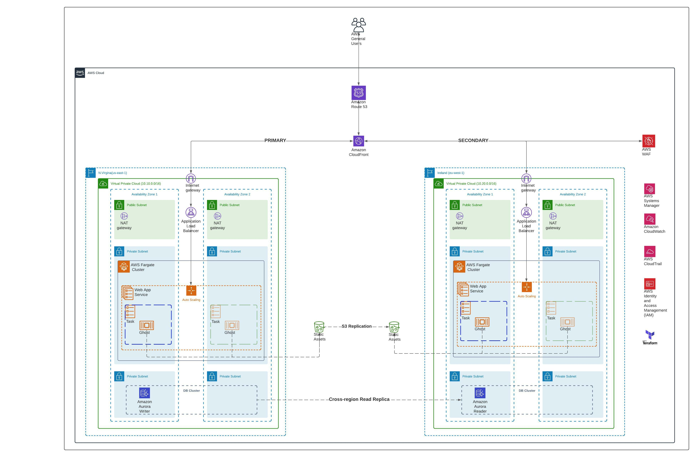
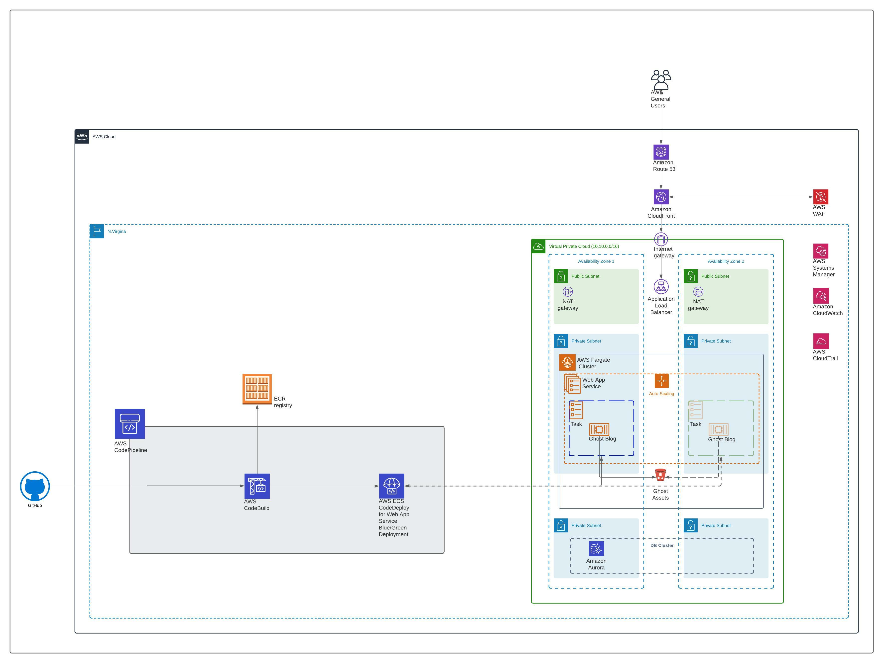

# Nordcloud Interview

## Architecture Diagram for Ghost Blog

## CI/CD Diagram for Ghost Blog

## Inputs

| Name| Description| Type| Default| Required|
| :--- | :---: | :---: | :---: | :---: |
| var_region           | Primary region of your ghost blog            | String           | <code>us-east-1</code>       | No |
| var_secondary_region | DR region of your ghost blog                 | String           | <code>us-east-2</code>       | No |
| var_profile          | AWS CLI Profile name                         | String           | <code>default</code>         | No |
| var_vpc_cidr         | VPC CIDR for Primary Region                  | String           | <code>10.10.0.0/16</code>    | No |
| env                  | Environment name used for primary region     | String           | <code>main</code>            | No |
| acm_pri_alb          | AWS ACM ARN used for primary region AWS ALB  | String           | <code>""</code>              | Yes|
| acm_sec_alb          | AWS ACM ARN used for DR region AWS ALB       | String           | <code>""</code>              | Yes|
| acm_cf               | AWS ACM ARN used for Amazon Cloudfront       | String           | <code>""</code>              | Yes|
| hostnames            | Hostname used for ghost blog                 | String           | <code>""</code>              | Yes|
| var_dr_env           | Environment name used for DR region          | String           | <code>"main-dr"</code>       | No |
